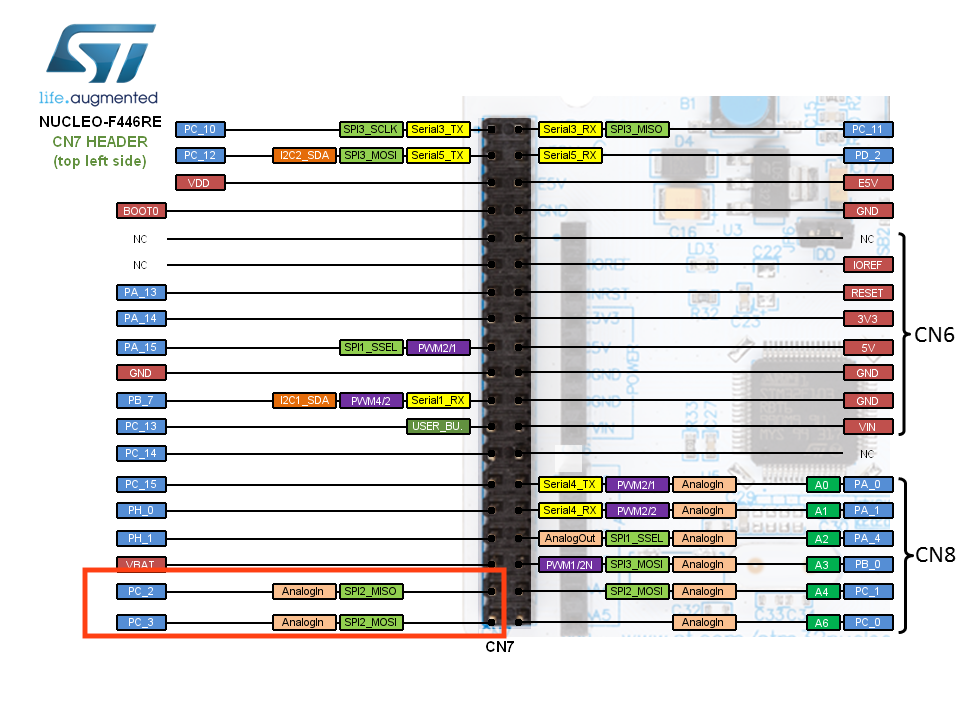
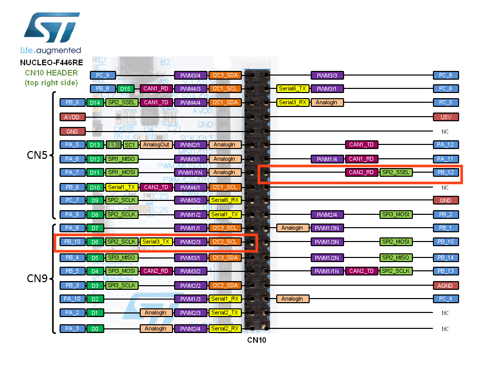
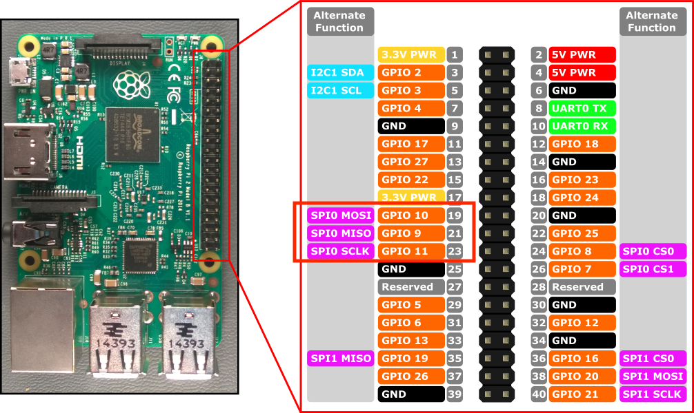

# test SPI sur STM3F446RE(slave) / Raspberry(master)

| SPI       | Master | Slave | 
|    ---    |  ---   | ---   |
| ground    | pin 25 | GND   |
| SPI2_SCK  | pin 23 | PB10  |
| SPI2_MISO | pin 21 | PC2   |
| SPI2_MOSI | pin 19 | PC3   |

#### stm32
 
 

#### raspberry 3

####  stm:
###### compiler et televerser: 
    ouvrir et compiler le projet avec stm32CubeIDE puis
    $> cp spi_stm32F4/Release/spi_stm32F4.bin /Volumes/NODE_F446RE/.
###### lecture port serie:
    $> screen /dev/tty.usbmodem**** 115200

##### Raspberry:
###### execution:
    /Raspberry_MasterSPI/ $> python3 line.py

