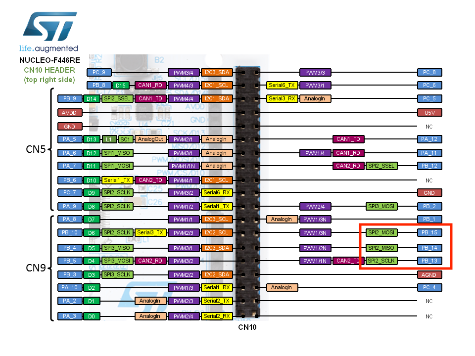

# test SPI sur STM3F446RE(slave) / Raspberry(master)

SPI | Carte Master | Carte Slave | 
| --- | --- | --- |
ground | pin 25 | GND
SPI2_SCK | pin 23	|	PB13
SPI_MISO | pin 21 | PB14
SPI2_MOSI| pin 19 | PB15

#### stm32

 

#### raspberry 3

####  stm:
###### compiler et televerser: 
    /stm32F446RE_spi_slave/Release $> make spi_stm32F4.bin && cp spi_stm32F4.bin /Volumes/NODE_F446RE/.
###### lecture port serie:
    ~ $> screen /dev/tty.usbmodem**** 115200

##### Raspberry:
<!-- ###### compilation: -->
   <!-- /Raspberry_MasterSPI/ $> gcc -o spi_write spi_master_write.c -->
###### execution:
<!-- /Raspberry_MasterSPI/ $> ./spi_write /dev/spidev0.1 100000 -->
    /Raspberry_MasterSPI/ $> python3 line.py

